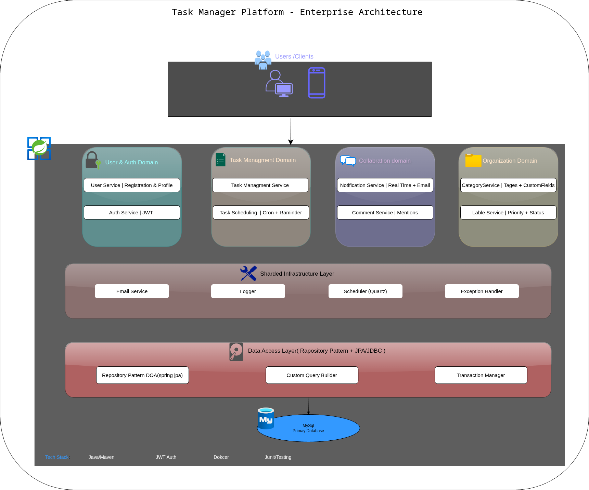

# TaskManager (Spring Boot)

A Spring Boot 3 application for managing tasks with categories, labels, and scheduling. It includes JWT-based authentication, WebSocket notifications, and optional email notifications.

🚀 About This Project

TaskManager is a modular Spring Boot application built to explore real-world backend development patterns: authentication, domain-driven structure, real-time WebSocket communication, scheduling, and integration testing.
It started as my first serious Spring project and became the foundation where I learned how to design clean backend architecture instead of just building another CRUD app.

🔥Motivation

I built TaskManager as my first full Spring Boot application to develop real-world backend skills.
The goal was to learn how to design a modular monolithic backend with authentication, domain separation, real-time communication, and scheduled background work.

This project became a training ground for:
   - Handling user authentication (JWT)
   - Implementing WebSocket-based instant notifications
   - Writing integration tests using Testcontainers
   - Working with Docker for local development
   - Managing scheduling, mail delivery, and event-driven patterns inside a monolith



## Stack
- Language: Java 18
- Framework: Spring Boot 3.1.3 (Web, Security, Data JPA, Validation, WebSocket, Mail)
- API Docs: springdoc-openapi (Swagger UI)
- Database: MySQL 8
- Build & Package Manager: Maven
- Testing: JUnit 5 + Spring Boot Test + Testcontainers (MySQL)

## Requirements
- Java 18 (JDK)
- Maven 3.8+
- Docker + Docker Compose (optional, required for Testcontainers, and for running MySQL easily)
- MySQL 8+ (if you don’t use Docker)

## Quick Start

### 1) Configure environment
The application reads configuration from environment variables (see the full list below). For local development you can export variables in your shell or use an `.env` mechanism of your choice.

Minimal variables to connect to MySQL:
```
export ACTIVE_PROFILE=dev
export MYSQL_HOST=localhost
export MYSQL_PORT=3307
export MYSQL_DB=task-manger
export MYSQL_USERNAME=<your_db_user>
export MYSQL_PASSWORD=<your_db_password>
```
If you plan to use email features (optional):
```
export EMAIL_HOST=<smtp_host>
export EMAIL_PORT=<smtp_port>
export EMAIL_ID=<smtp_username>
export EMAIL_PASSWORD=<smtp_password>
export VERIFY_EMAIL_HOST=http://localhost:8080
```

### 2) Start MySQL
- Option A: Docker Compose (recommended for dev)
  - Review `compose.yaml` credentials. They are currently hard-coded for local dev. Change them before use or set your own values. Then run:
    ```bash
    docker compose up -d db
    ```
  - This exposes MySQL on `localhost:3307` by default.
- Option B: Local MySQL 8+
  - Create a database named `task-manger` (or set `MYSQL_DB` to your DB name) and ensure the user and password match your env vars.

### 3) Run the application
- Using Maven (dev):
  ```bash
  mvn spring-boot:run
  ```
- Or build a jar and run:
  ```bash
  mvn clean package
  java -jar target/TaskManager-0.0.1-SNAPSHOT.jar
  ```

The API will be available on `http://localhost:8080` by default.

- OpenAPI/Swagger UI:
  - http://localhost:8080/swagger-ui.html (redirects to UI)
  - or http://localhost:8080/swagger-ui/index.html

## Entry Point
- Main class: `com.project.TaskManager.Application`

## Profiles
- Active profile is controlled by `ACTIVE_PROFILE` environment variable. Default is `dev`:
  - `spring.profiles.active=${ACTIVE_PROFILE:dev}`

## Environment Variables
Defined and/or referenced in `src/main/resources/application.yml`.

- App/Profile
  - `ACTIVE_PROFILE` — Spring profile to activate. Default: `dev`.
- MySQL
  - `MYSQL_HOST` — MySQL host (e.g., `localhost`).
  - `MYSQL_PORT` — MySQL port (e.g., `3307` when using the provided compose file).
  - `MYSQL_DB` — Database name (default compose uses `task-manger`).
  - `MYSQL_USERNAME` — DB username.
  - `MYSQL_PASSWORD` — DB password.
- Email (optional; required only if you use mail features)
  - `EMAIL_HOST` — SMTP host (e.g., `smtp.gmail.com`).
  - `EMAIL_PORT` — SMTP port (e.g., `587`).
  - `EMAIL_ID` — SMTP username/login (email address).
  - `EMAIL_PASSWORD` — SMTP password or app password.
  - `VERIFY_EMAIL_HOST` — Base URL used in verification emails (e.g., `http://localhost:8080`).

## How to Run Tests
Tests use JUnit 5 and Testcontainers (MySQL). You need Docker running.

- Run all tests:
  ```bash
  mvn test
  ```
If Docker is not available, integration tests that rely on Testcontainers will fail. Consider enabling Docker or adjusting tests for your environment.

## Scripts and Useful Commands
- Start the app in dev: `mvn spring-boot:run`
- Build: `mvn clean package`
- Run unit/integration tests: `mvn test`
- Start database via Docker Compose: `docker compose up -d db`
- Stop database: `docker compose down`

## Project Structure 
```
src/
├─ main/
│  ├─ java/com/project/TaskManger/
│  │  ├─ TaskMangerApplication.java                 # Entry point
│  │  ├─ config/                                    # App & WebSocket config
│  │  ├─ security/                                  # JWT, security config, auth
│  │  ├─ task/                                      # Task domain, service, API
│  │  ├─ category/                                  # Category domain, API
│  │  ├─ category/label/                            # Label domain, API
│  │  ├─ taskScheduling/                            # Scheduling domain & API
│  │  └─ notification/                              # Mail + WebSocket messaging
│  └─ resources/
│     ├─ application.yml                            # Main Spring config (env-driven)
│     ├─ application-dev.yml                        # Dev overrides (see notes)
│     └─ static/                                    # Static client files (demo)
└─ test/java/com/project/TaskManger/                # Unit & integration tests
```


## License

This project is licensed under the MIT License. See the LICENSE file for details.


